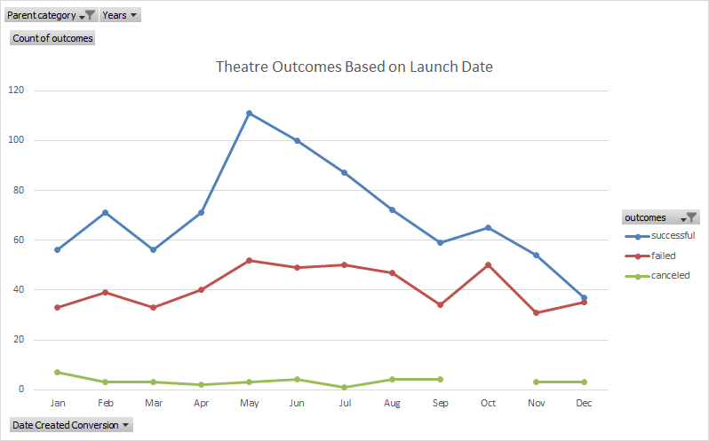
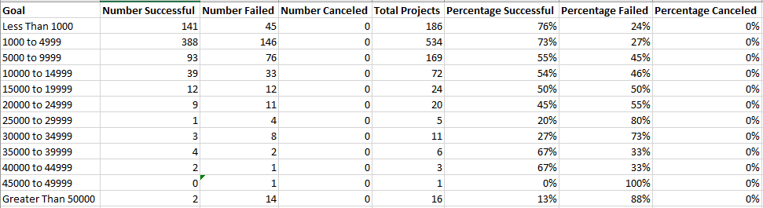
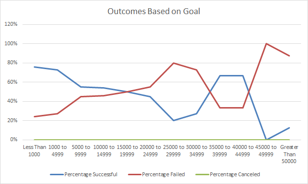

# Kickstarting with Excel

## Overview of Project
Louise, an up-and-coming playwright, plans to start a croudfunding campaign to fund her play "*Fever.*" She has estimated a budget of over $10,000 and is hesitant to begin her first crowdfunding attempt, so she has come to me for help. 

### Purpose
In order to increase the chances of a successful crowdfunding campaign, I have sorted and analyzed data from crowdfunding campaigns accross multiple categories spanning from 2009 to 2017. The goal is to determine the optimal scenarios for Louise to start her crowdfunding campaign so that it has a greater chance of success. Some variables of the crowdfunding campaign are constant, such as the category and subcategory being "theater" and "plays" respectively, but by examining the effects of the launch dates and the goal amounts on the crowdfunding outcomes, I hope to determine the best method for Louise to proceed with her crowdfunding campaign.  

## Analysis and Challenges

### Analysis of Outcomes Based on Launch Date
To determine the impact of the crowdfunding campaign's launch date on the outcome of the campaign, I had to first reorganize the data so that extraneous data was excluded and the displayed data was more user friendly. This involved translating the launch date data from unix timestamps to the more familiar mm/dd/yyyy format and creating a pivot table of the Kickstarter sheet that sorted campaign outcomes by dates created. Next, I filtered the pivot table to only include the "theater" category, show the "date created" as months, and to exclude any campaigns that were currently live. This left me with a table showing "theater" campaign results per month, which I used to create a line graph that visualizes outcome trends based on launch dates. 

### Analysis of Outcomes Based on Goals
To determine the impact of the crowdfunding campaign's funding goal on the outcome of the campaign, I created a new Excel sheet and listed a series of goal ranges increasing in $5000 incriments. Then, using Excel's COUNTIFS equation, I counted the total number of "successful", "failed", and "canceled" campaigns in the subcategory of "play" for each goal range. 

This created a table that allowed me to calculate the percentage of successful, failed, and canceled campaigns per goal range. I then plotted these percentages per goal range in a line graph to visualize the trends of success rates across all goal ranges.

### Challenges and Difficulties Encountered
While I did not encounter any challenges while compiling this analysis, I can imagine some challenges that would make analysing this data more difficult. One challenge would be if I discovered that some relevant data was either missing or corrupted, as this would force me to track down the original datasets or risk skewing my results. Another challenge would have occured if an explanation of the COUNTIFS function in Excel wasn't explained to me. There are many functions and equations in Excel that make sorting and interpreting data simple, and if I was not aware of the relevant equations, I would waste a lot of time tediously sorting data manually and inputting unnecessary equations.

## Results

- **What are two conclusions you can draw about the Outcomes based on Launch Date?**
	Firstly, I can conclude that there is a higher rate of successful Theater campaigns when they are launched during May, June, and July. I can also conclude that the launch date has no meaningful effect on the rate of canceled theater campaigns.

- **What can you conclude about the Outcomes based on Goals?**
	I can conclude that plays with a goal of $15,000 or less are more likely to succeed than plays with higher funding goals. In the "Outcomes Based on Goals" chart, there is spike in the rate of successful campaigns between $35,000 and $45,000, but if you examine the outcomes table showing the total numbers, you can see that the total number of campaigns within that goal range is only 9. Therefore, I believe that data is too unreliable to act upon.

- **What are some limitations of this dataset?**
	The most obvious limitation of this dataset to me is the lack of any data concerning the marketing of the crowdfunding campaigns. Since the premise of a crowdfunding campaign is to ask interested people to invest their money into your project, then exposing your campaign to greater numbers of people should increase your chances of finding interested investors. Data describing the reach of the campaigns across various social medias, as well as any initial expendatures on marketing for campaigns would provide a more indepth look into what factors help a campaign succeed.

- **What are some other possible tables and/or graphs that we could create?**
	Other possible tables that we could create include a table that compares the backer counts to both "staff pick" and "spotlight" status to see if either of these variables had a meaningful influence on the number of people who supported a campaign. We could also create bar graphs showing the average backer counts and average donations per category.
